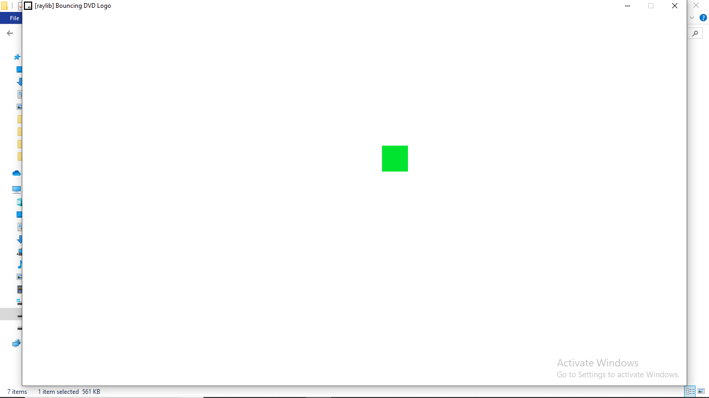

# bouncing-dvd-logo-raylib

Port of "Bouncing DVD Logo" from DragonRuby GTK, Based on [this](https://gist.github.com/amirrajan/83c368bfc4f153abdfba995458d8943a) gist, Using [raylib](https://github.com/raysan5/raylib) with C99!

<br><br>

### Build and Run

First, You should have [raylib](https://github.com/raysan5/raylib) built for a platform with `make`, Then edit makefile to set path of gcc and raylib!

If you don't know about building raylib, See "Development Platforms" in [raylib wiki](https://github.com/raysan5/raylib/wiki)

Then...

```
make					# Make, And also set platform (Example: PLATFORM=PLATFORM_DESKTOP)
./bouncing_dvd_logo		# Or just bouncing_dvd_logo on Windows instead...
```

### License

See [`LICENSE.txt`](https://github.com/Rabios/bouncing-dvd-logo-raylib/blob/master/LICENSE.txt) for repo license and [`LICENSE.txt`](https://github.com/Rabios/bouncing-dvd-logo-raylib/blob/master/LICENSE.txt) for third party licenses...